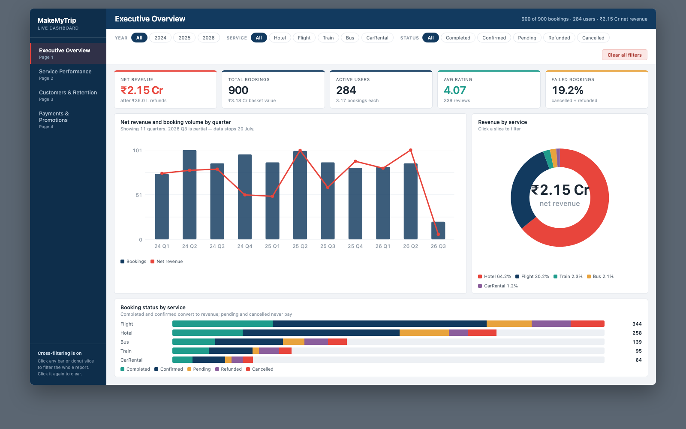
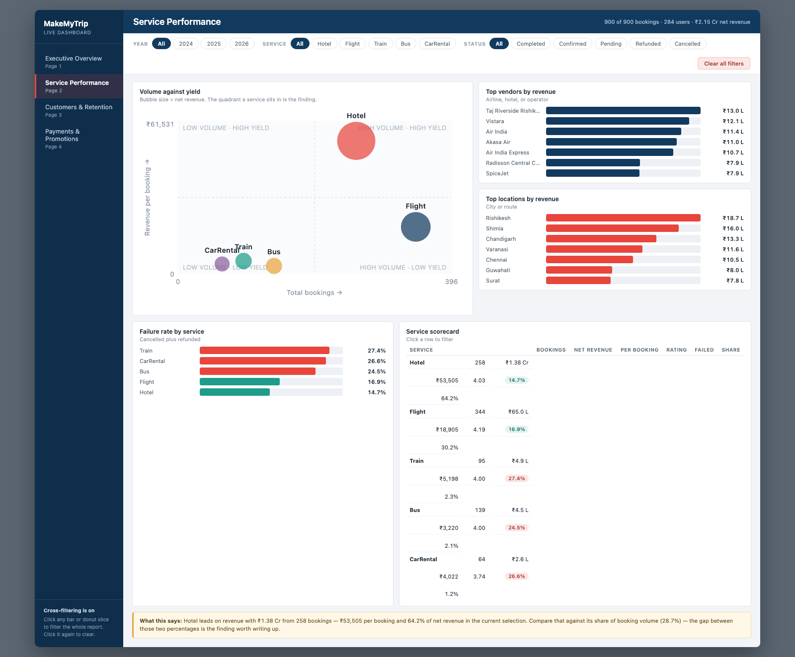
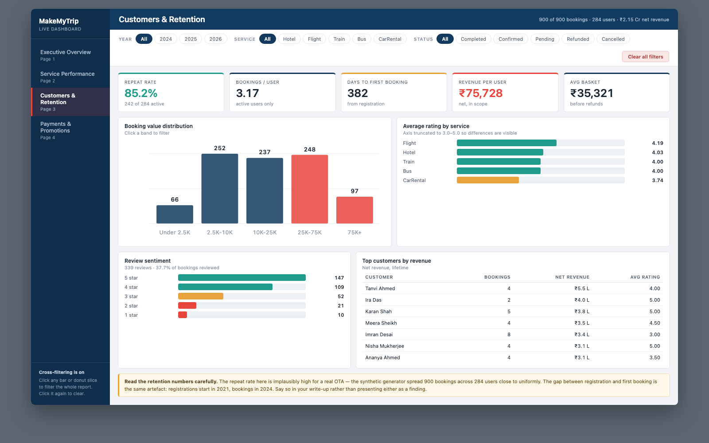
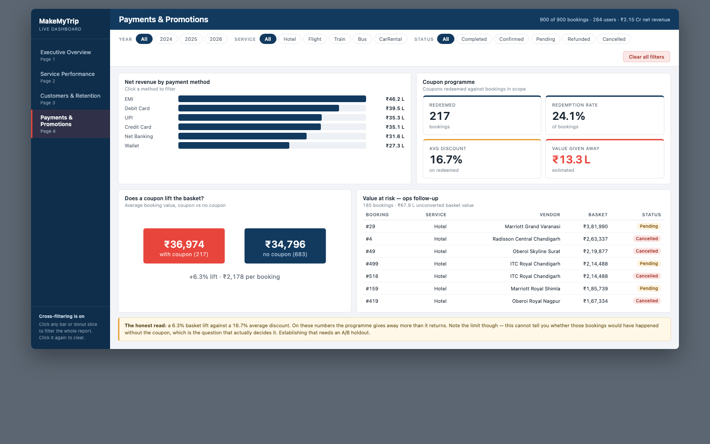
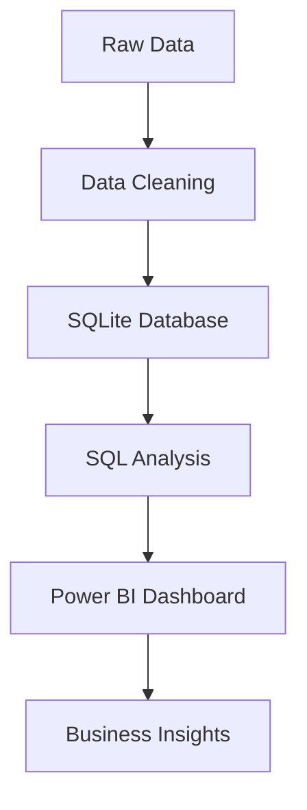

<div align="center">

# ✈️ MakeMyTrip Travel Analytics

**SQL • Power BI • Python**
**End-to-End Business Intelligence Project**

By **Navdeep Taliyan**

</div>

<div align="center">


**🔴 [View the Live Dashboard](https://beingnav.github.io/MakeMyTrip-Travel-Analytics/power-bi/Live_Dashboard.html)**

</div>

---

## 📌 Project Overview

End-to-end analytics on a MakeMyTrip-style travel-booking dataset — the same data explored three ways: an **exploratory data analysis** in Python, a **SQL database** with a 20-query analysis library, and a **Power BI** semantic model with an interactive dashboard.

Flights, hotels, buses, trains and car rentals across India, Jan 2024 – Jul 2026. 900 bookings, 284 active users, 15 related tables.

---

## 🎯 Business Objectives

- Analyze booking trends across services and time
- Evaluate hotel, flight, and vendor performance
- Identify top customers and repeat-booking behaviour
- Understand payment method preferences and coupon ROI
- Discover customer satisfaction trends from reviews
- Build executive-ready, cross-filterable dashboards

---

## 🛠 Tech Stack

- **SQLite** (portable to MySQL / PostgreSQL)
- **Power BI** (PBIP format) + DAX
- **Python** — pandas, matplotlib, seaborn, Jupyter
- **Git & GitHub**

---

## 📂 Dataset

The project contains 15 relational tables — a core booking pipeline plus one supply/detail table per service.

| Table | Description |
|--------|-------------|
| Users | Customer details |
| Bookings | Core travel bookings (links to all services) |
| Payments | Payment transactions |
| Reviews | Customer reviews and ratings |
| DiscountCoupons | Coupon programme redemptions |
| Flights / FlightBookings | Flight inventory and bookings |
| Hotels / HotelBookings | Hotel inventory and bookings |
| Trains / TrainBookings | Train inventory and bookings |
| Buses / BusBookings | Bus inventory and bookings |
| CarRentals / CarRentalBookings | Car rental inventory and bookings |

---

## 📊 Dashboard Pages

✅ Executive Overview

✅ Service Performance

✅ Customers & Retention

✅ Payments & Promotions

---

## 📈 Key KPIs

- Net Revenue — ₹2.15 Cr
- Total Bookings — 900
- Active Users — 284
- Average Rating — 4.07
- Failed Bookings (cancelled + refunded) — 19.2%
- Booking Realisation Rate — 68%

---

## 🔍 SQL Concepts Used

- Joins
- Group By
- Aggregate Functions
- CASE expressions
- Window Functions
- CTEs
- Views

---

## 💡 Business Insights

- **Hotels are the business; flights are the funnel.** Hotels are 29% of bookings but **64% of revenue** (₹53K per booking); flights are 38% of bookings but 30% of revenue (₹19K per booking).
- **One booking in five never converts.** 9% cancelled, 10% refunded — of ₹3.18 Cr in basket value, ₹2.15 Cr is kept after refunds (68% realisation).
- **The cheap services are also the unreliable ones.** Trains, cars, and buses fail roughly twice as often as hotels.
- **The coupon programme doesn't obviously pay for itself** — a 6.3% basket lift bought with a 16.7% average discount.

---

## 🖼️ Dashboard Preview

**Interact with it live: [beingnav.github.io/MakeMyTrip-Travel-Analytics/power-bi/Live_Dashboard.html](https://beingnav.github.io/MakeMyTrip-Travel-Analytics/power-bi/Live_Dashboard.html)**

### Executive Overview


---

### Service Performance


---

### Customers & Retention


---

### Payments & Promotions


---

### Data Model


---

## 🔄 Project Workflow



---

## 📁 Project Structure

```
data/                   Source CSVs shared by all three projects
sql/                    SQLite database, schema, views, analysis queries
power-bi/               Power BI semantic model + interactive dashboard
eda/                    Python exploratory data analysis notebook
docs/images/            ER diagram and query screenshots
dashboard_screenshots/  Dashboard preview images used in this README
README.md
```

Each folder has its own README with setup steps.

---

## 📝 Data Note

Synthetic dataset, seeded for reproducibility. Prices are illustrative INR ranges; user passwords in the source are masked placeholders and are dropped on load in every project. Not affiliated with or endorsed by MakeMyTrip.

---

## 👨‍💻 Author

**Navdeep Taliyan**

Aspiring Data Analyst

SQL | Power BI | Python
