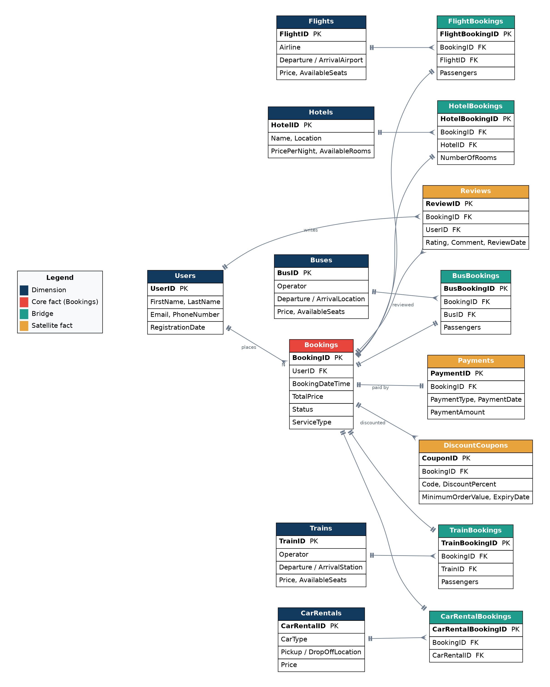

# MakeMyTrip Analytics

End-to-end analytics on a MakeMyTrip-style travel-booking dataset — the same data explored three ways: an **exploratory data analysis** in Python, a **SQL database** with an analysis query library, and a **Power BI** semantic model with an interactive dashboard.

Flights, hotels, buses, trains and car rentals across India, Jan 2024 – Jul 2026. 900 bookings, 300 users, 15 related tables.

---

## What's in here

| Folder | Project | Open this first |
|---|---|---|
| [`eda/`](eda) | Exploratory data analysis (pandas, matplotlib, seaborn) | [`MakeMyTrip_EDA_rendered.html`](eda/MakeMyTrip_EDA_rendered.html) — the executed notebook, no install needed |
| [`sql/`](sql) | SQLite database + 20-query analysis library | [`03_analysis_queries.sql`](sql/03_analysis_queries.sql), results in [`query_results.txt`](sql/query_results.txt) |
| [`power-bi/`](power-bi) | Power BI semantic model + dashboard | [`Live_Dashboard.html`](power-bi/Live_Dashboard.html) — interactive, runs in any browser |
| [`data/`](data) | The 15 source CSVs, shared by all three projects | — |
| [`docs/images/`](docs/images) | ER diagram and query screenshots | — |

Each folder has its own README with setup steps.

---

## The headline findings

All three projects reproduce the same numbers from the same data:

- **Hotels are the business; flights are the funnel.** Hotels are 29% of bookings but **64% of revenue** (₹53K per booking); flights are 38% of bookings but 30% of revenue (₹19K per booking). Ground transport — bus, train, car — is a third of bookings and under 6% of revenue.
- **One booking in five never converts.** 9% cancelled, 10% refunded. Of ₹3.18 Cr in basket value, ₹2.15 Cr is kept after refunds (68% realisation).
- **The cheap services are also the unreliable ones.** Trains, cars and buses fail roughly twice as often as hotels.
- **The coupon programme doesn't obviously pay for itself** — a 6% basket lift bought with a 17% average discount.

## Two things to know about the numbers

**Net revenue ≠ sum of payments.** Payments exist only for Confirmed, Completed and Refunded bookings; Pending and Cancelled never paid, and Refunded reversed. So basket value (₹3.18 Cr) > gross (₹2.50 Cr) > net (₹2.15 Cr). All three projects headline **net**.

**The data is synthetic.** It matches a real schema but was generated, not sampled. Perfect referential integrity, an 85% repeat rate, and the absence of seasonality are all properties of the generator, not customer behaviour. Each project flags these as limitations rather than findings — that separation is deliberate.

---

## Tech

Python 3 · pandas · matplotlib · seaborn · Jupyter · SQLite (portable to MySQL / PostgreSQL) · Power BI Desktop (PBIP format) · DAX

## Data note

Synthetic dataset, seeded for reproducibility. Prices are illustrative INR ranges; user passwords in the source are masked placeholders and are dropped on load in every project. Not affiliated with or endorsed by MakeMyTrip.
