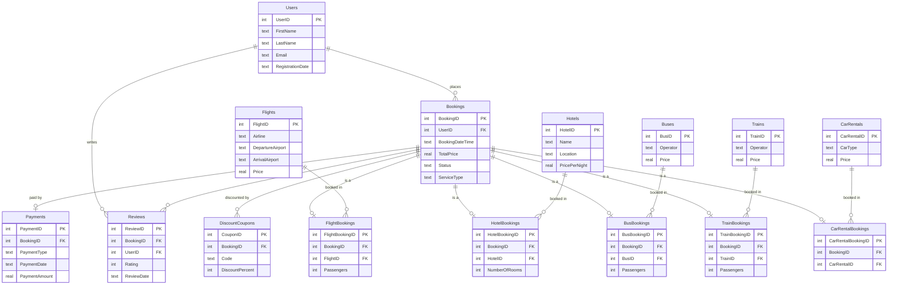

# MakeMyTrip — Entity-Relationship Diagram

Renders on GitHub, in VS Code (Mermaid extension), or at [mermaid.live](https://mermaid.live).

## How to read it

A **Booking** is the hub. Every booking belongs to one **User**, is for exactly one service, and reaches that service's inventory through a **bridge** table (`FlightBookings`, `HotelBookings`, and so on). The bridge pattern is what lets one `Bookings` table cover five different service types without five sets of nullable columns.

Hanging off each booking are its **Payment** (at most one — Pending and Cancelled bookings have none), any **Reviews**, and any **DiscountCoupons** redeemed against it.

The `ServiceType` column on `Bookings` is redundant with the bridges — it records directly what the bridge tables imply — but it makes filtering by service a single-table operation instead of a five-way check.
