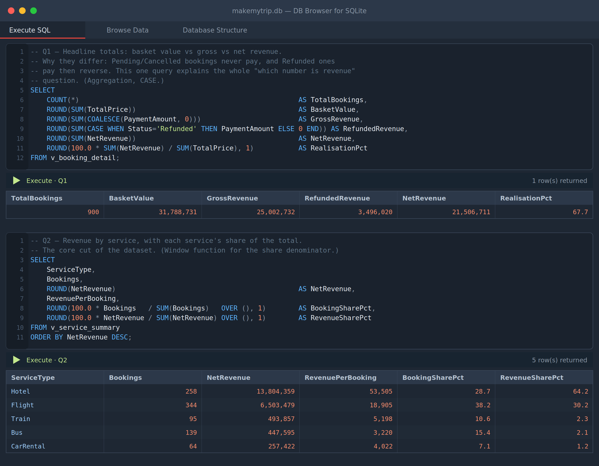
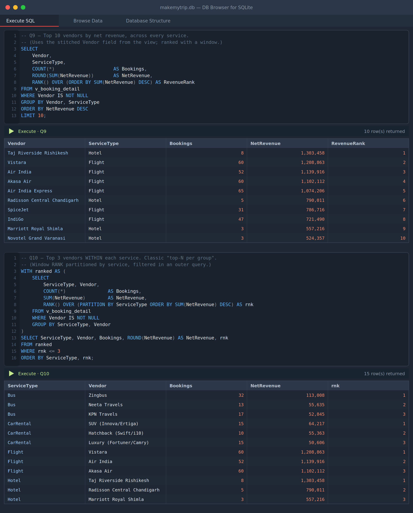

# MakeMyTrip — SQL Project

A relational database for a travel-booking platform (flights, hotels, buses, trains, car rentals; India; Jan 2024 – Jul 2026), with a schema, the data, reusable views, and a 20-query analysis library.

Everything here has been built and run against a live SQLite database — the numbers in `query_results.txt` are the actual output, not hand-written examples.

## Files

| File | What it is |
|---|---|
| `01_schema.sql` | DDL — 15 tables with primary keys, foreign keys, and CHECK constraints |
| `02_views.sql` | Two views that encapsulate net-revenue logic and the vendor/location join |
| `03_analysis_queries.sql` | 20 business questions, grouped, each annotated with the technique it uses |
| `load_data.py` | Builds `makemytrip.db` from the schema + CSVs |
| `makemytrip.db` | The ready-to-use SQLite database (already built) |
| `makemytrip_dump.sql` | Portable SQL dump — schema + all INSERTs in one file |
| `query_results.txt` | Expected output for all 20 queries, to check your own runs against |
| `ER_diagram.md` | The entity-relationship diagram (Mermaid) |
| `data/` | The 15 source CSVs |

## Fastest way in

The database is already built. If you have the `sqlite3` CLI:

```bash
sqlite3 makemytrip.db < 03_analysis_queries.sql
```

Or explore it interactively:

```bash
sqlite3 makemytrip.db
sqlite> .tables
sqlite> .read 03_analysis_queries.sql
```

No CLI? Open `makemytrip.db` in [DB Browser for SQLite](https://sqlitebrowser.org/) (free, cross-platform) and paste queries into the Execute SQL tab.

## Rebuild from scratch

```bash
python load_data.py
```

Drops and recreates `makemytrip.db`, loads all 15 CSVs in foreign-key-safe order, creates the views, and runs a foreign-key integrity check (it passes — zero violations).

## What the queries cover

- **A. Revenue and volume** (Q1–4) — the basket/gross/net distinction, revenue by service, the volume-vs-revenue gap, price-band distribution
- **B. Status and reliability** (Q5–8) — status mix, failure rates, cancel-vs-refund split, value at risk
- **C. Suppliers** (Q9–11) — top vendors overall, top-N per service, top hotel cities
- **D. Customers** (Q12–14) — repeat vs one-time, top customers, activation gap
- **E. Reviews** (Q15–16) — rating distribution and satisfaction score, review coverage
- **F. Payments and promotions** (Q17–18) — payment mix, coupon impact
- **G. Time series** (Q19–20) — running total + moving average, year-on-year with `LAG`

Techniques on show: multi-table joins, `GROUP BY`/`HAVING`, correlated and non-correlated subqueries, CTEs, window functions (`RANK`, `LAG`, running `SUM`, moving `AVG`), `CASE` bucketing, and views.

## Two things the data does that will confuse you otherwise

**Net revenue is not the sum of payments.** Payments exist only for Confirmed, Completed and Refunded bookings — Pending and Cancelled never paid. And Refunded bookings paid, then reversed. So:

- Basket value (`SUM(TotalPrice)`): ₹3.18 Cr — everything customers put in a cart
- Gross revenue (`SUM(PaymentAmount)`): ₹2.50 Cr — what was actually paid
- Net revenue: ₹2.15 Cr — gross minus ₹35.0 L of refunds

The `NetRevenue` column in `v_booking_detail` handles this, so lean on the view rather than summing `Payments` directly. Q1 lays all three side by side.

**2026 stops on 20 July.** The last quarter is partial and Q4 is missing entirely, so the `LAG`-based year-on-year in Q20 shows 2026 dropping sharply. That's the data ending, not a real decline — the query has a comment saying so.

## Running it on MySQL or PostgreSQL

The SQL is mostly standard. To port:

- **`||` string concatenation** (Q9–11) → keep as-is on PostgreSQL; on MySQL use `CONCAT(a, '-', b)`.
- **`substr(date, 1, 7)` for year-month** (views, Q19–20) → works on both, but the cleaner form is `TO_CHAR(col::date, 'YYYY-MM')` (Postgres) or `DATE_FORMAT(col, '%Y-%m')` (MySQL), once the date columns are a real `DATE`/`TIMESTAMP` type instead of text.
- **`julianday()` date arithmetic** (Q14) → Postgres: `(first_booking::date - reg::date)`; MySQL: `DATEDIFF(first_booking, reg)`.
- **`INTEGER PRIMARY KEY`** → `INT AUTO_INCREMENT PRIMARY KEY` (MySQL) or `SERIAL`/`INT` (Postgres); you're inserting explicit IDs so auto-increment is optional.
- Load the CSVs with `LOAD DATA INFILE` (MySQL) or `\copy` (Postgres) instead of `load_data.py`, keeping the same FK-safe order.

Window functions (`RANK`, `LAG`, framed `AVG`) work on MySQL 8.0+ and any modern PostgreSQL.

## A note on the data

It's synthetic — generated to match the schema, not real transactions. Perfect referential integrity and zero nulls are a property of that, not of a real pipeline. Two figures that look like findings are generation artefacts: the 85% repeat rate (Q12) and the ~383-day activation gap (Q14) both come from bookings being spread near-uniformly across users, with registration dates predating the booking window. Real query results, but interpret them as limitations rather than insights.

## Screenshots

Query output rendered from the live database (full-size images in [`../docs/images/`](../docs/images)):





The [ER diagram](../docs/images/ER_diagram.png) is also in `docs/images/`.
